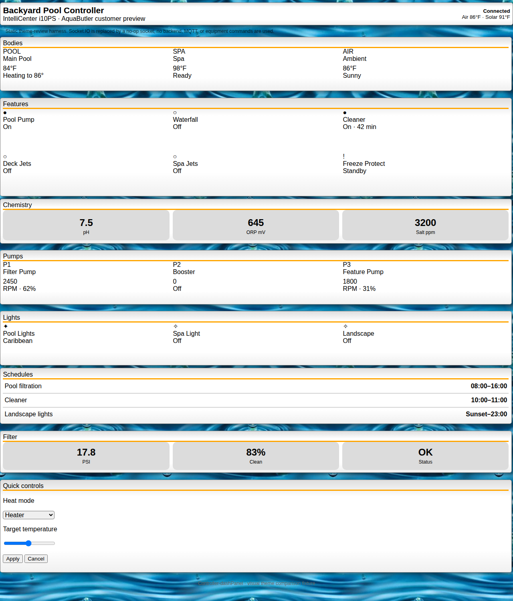
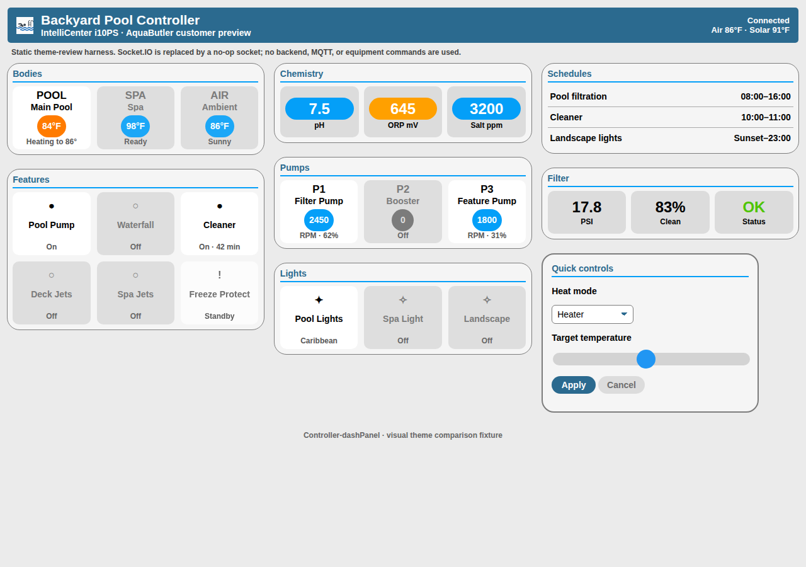

# AqualinkD Theme: Before and After

The screenshots below use the same static dashboard fixture so the difference is attributable to the theme rather than equipment state. The fixture stubs `window.io` with a no-op socket, allowing the dashboard visual structure to render without a poolController backend while preserving the existing socket event contract.

## Before — legacy default theme

The legacy theme uses a photographic water background, vertically stacked full-width panels, orange dividers, browser-default form controls, and comparatively little grouping within each equipment panel.

## After — Modern (AqualinkD)

The AqualinkD theme changes the presentation without changing dashboard behavior:

- **Color:** replaces the image-heavy background with a light neutral canvas; uses a steel-blue header and section accents, bright-blue value badges, orange attention states, and dark active tiles.
- **Typography:** uses Helvetica Neue/system sans-serif fallbacks with stronger hierarchy for controller identity, section headings, equipment values, and secondary status text.
- **Grid:** organizes panels into a responsive three-column dashboard and equipment into consistent rounded tile grids instead of long full-width rows.
- **Controls:** gives selects, sliders, and buttons a cohesive flat treatment with rounded corners and clear primary/secondary states.
- **Branding:** adds the bundled AqualinkD white logo to the header; the theme has no external asset or font dependency.

## Verification

- Both screenshots were rendered at 1280px width using Chromium against the same HTML fixture.
- The AqualinkD render loaded `themes/aqualinkd/theme.css` with no failed resource requests.
- The generated screenshot was visually inspected for clipping, overlap, and broken assets; none were observed.
- No poolController backend, MQTT service, Balena deployment, or equipment command was involved.
